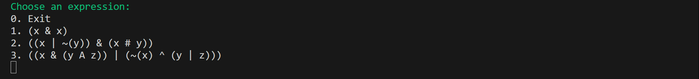
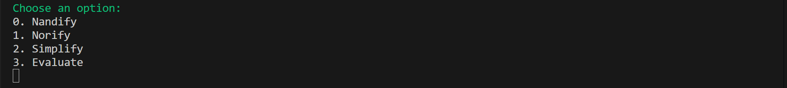
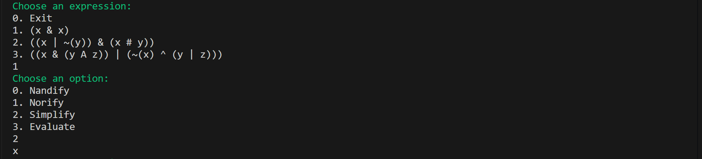
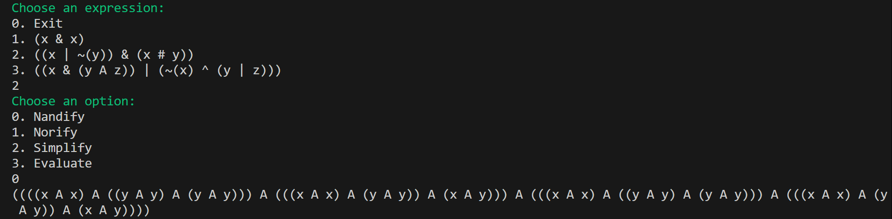
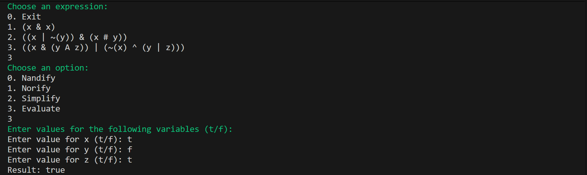

# Logic Expressions 🤖

💡 A simple Java project for creating, manipulating, and evaluating logical expressions.

## Table of Contents

1. [About](#about)  
2. [Features](#features)  
3. [Requirements](#requirements)  
4. [Installation](#installation)  
5. [Usage](#usage)  
6. [Table of Logical Expression Symbols](#table-of-logical-expression-symbols)  

---
## About
This repository contains a mini-project in Java focused on logical expressions. It demonstrates creating, manipulating, and evaluating expressions using operators such as AND, OR, NOT, NAND, NOR, XOR, and XNOR. The project features a unified menu system that allows users to select predefined expressions, perform operations like nandify, norify, simplify, or evaluate them with custom variable values. It serves as both a learning tool and a showcase of Java programming skills in object-oriented design.

---

## Features
- **Nandify** – Converts the selected logical expression to its NAND-only form.  
- **Norify** – Converts the selected logical expression to its NOR-only form.  
- **Simplify** – Simplifies the expression, applying basic logical simplifications.  
- **Evaluate** – Assigns boolean values to variables and calculates the resulting value of the expression.

---
## Requirements
To run this project, you’ll need:

* Java JDK installed (version 8 or higher).
* Git for version control and project management.

---
## Installation
Follow these steps to set up the project locally:

---

### 1. Clone the repository
```bash
git clone https://github.com/Amit-Bruhim/Logic-Expressions.git
```
### 2. Navigate into the src folder
```bash
cd Logic-Expressions/src
```
### 3. Compile the project
```bash
javac Main.java
```
### 4. Run the main program
```bash
java Main
```
---

## Usage

When you run the program, the following menu will appear:  



Choose:  
* `0` to exit the program  
* A number from the menu to select a logical expression  
* Any other input will display an error message  

After selecting an expression, choose one of the following options:  



### Examples

#### Example 1: Logical Expression 1 – Simplify


#### Example 2: Logical Expression 2 – Nandify


#### Example 3: Logical Expression 3 – Evaluate
Variable assignments:
* x = true
* y = false
* z = true


 ---

## Table of Logical Expression Symbols

| Symbol | Operation | Description                 |
|--------|-----------|------------------------------|
| `&`    | AND       | Logical AND                  |
| `\|`   | OR        | Logical OR                   |
| `~`    | NOT       | Logical NOT                  |
| `#`    | XNOR      | Exclusive NOR (not XOR)      |
| `^`    | XOR       | Exclusive OR                 |
| `V`    | NOR       | NOT OR                       |
| `A`    | NAND      | NOT AND                      |
